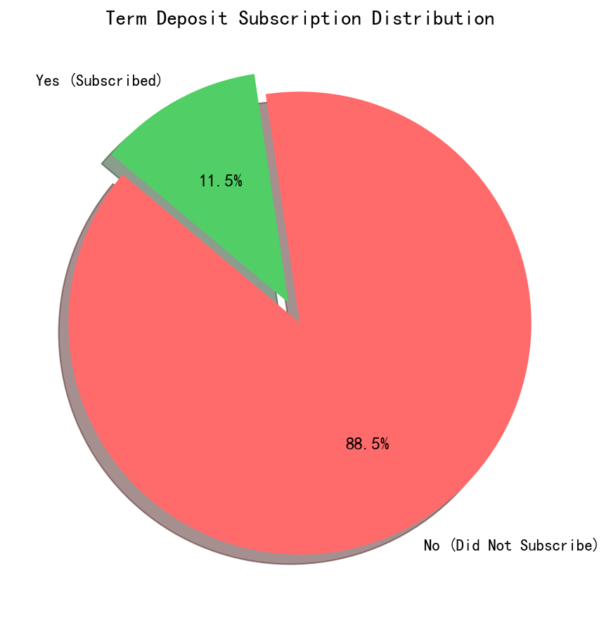
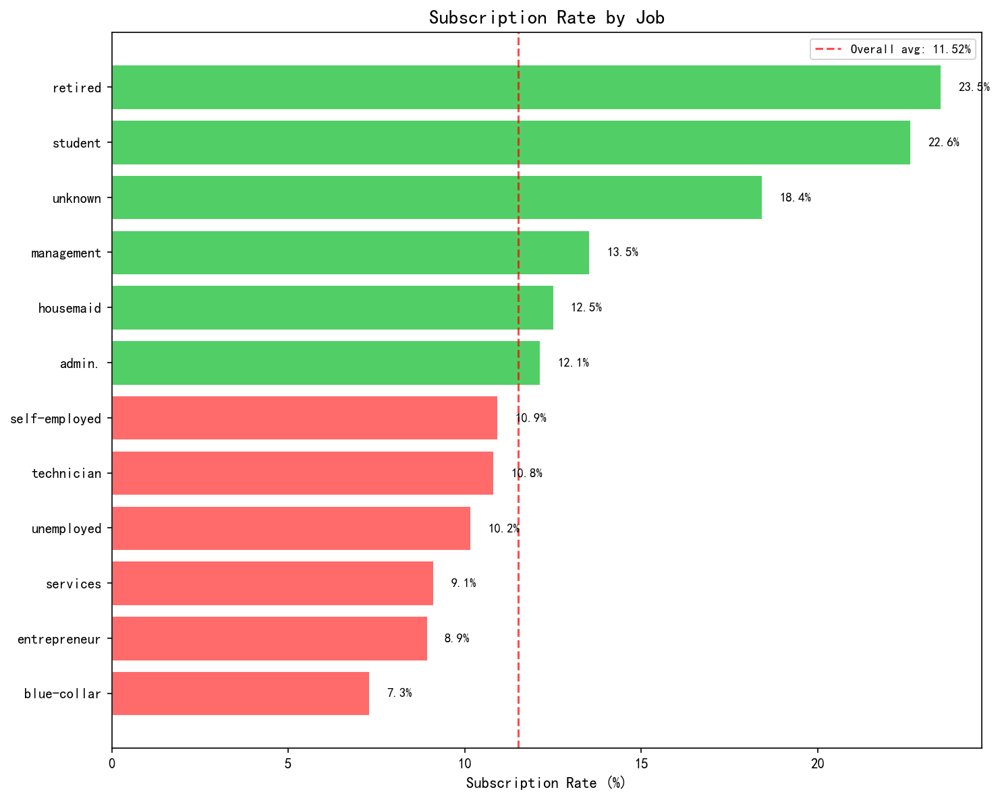
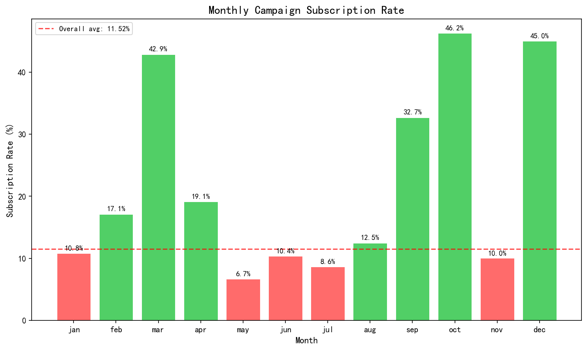
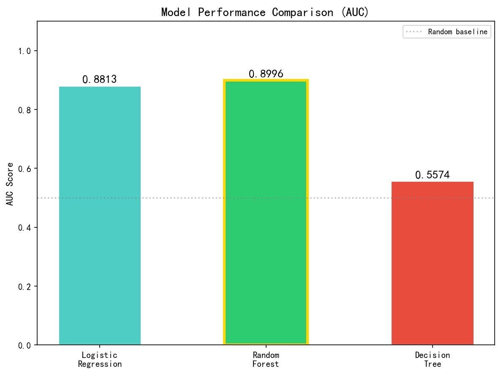
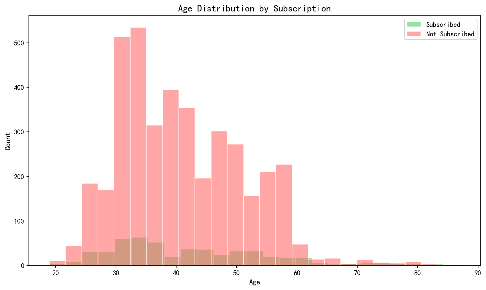
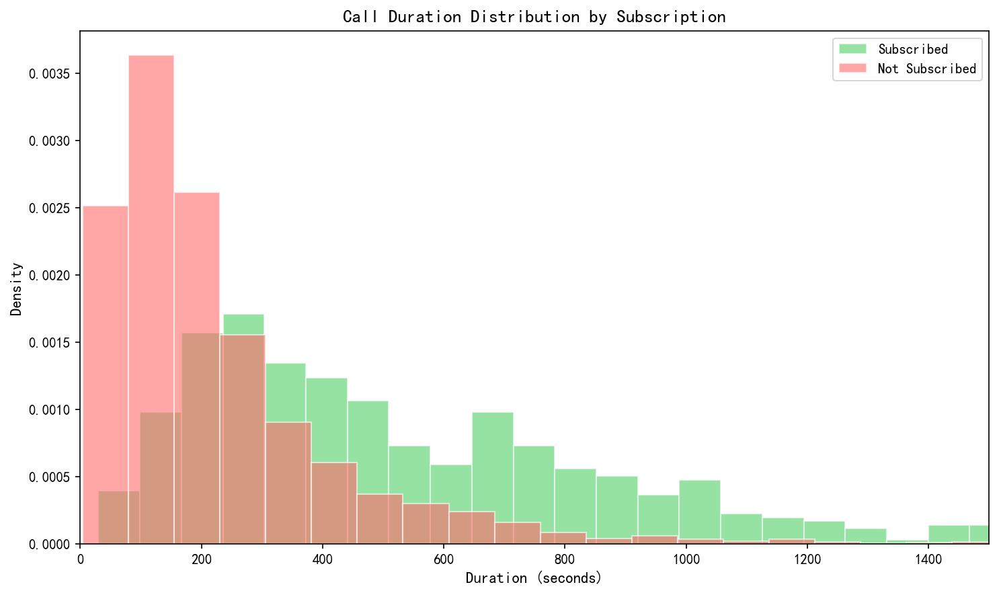
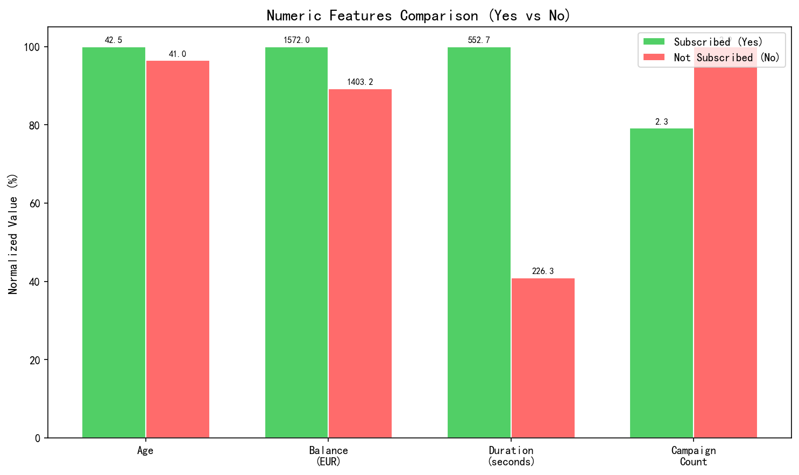
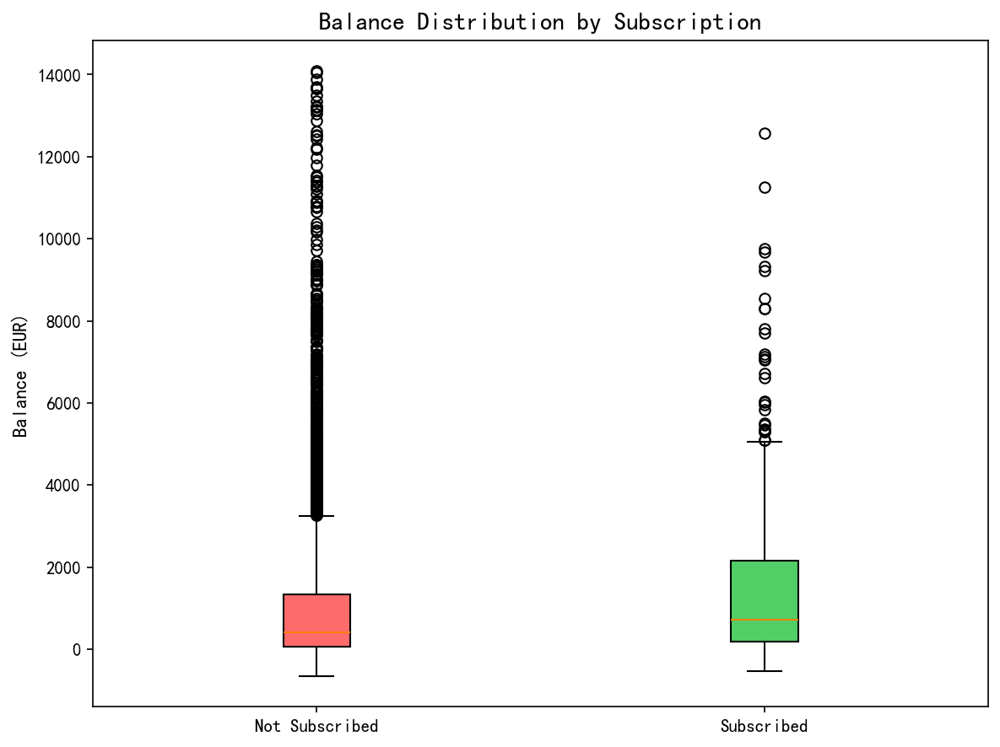
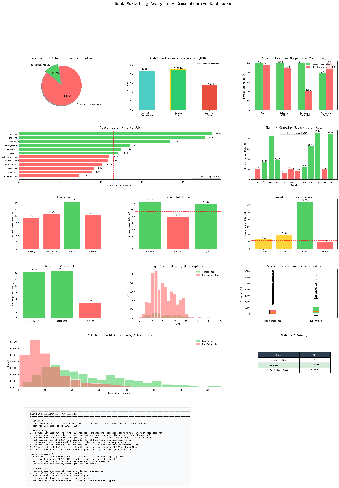

# Spark 综合实验报告

## 基于 Spark 的银行营销数据分析与定期存款订阅预测

| 项目 | 内容 |
| --- | --- |
| 姓名 | 陈礼盛 |
| 实验名称 | Spark 综合实验（期末） |
| 数据集 | Bank Marketing（`bank.csv`，4521 条记录 × 17 个特征） |
| 数据处理 | Python（pandas / numpy） |
| 核心分析 | Scala + Spark Core / SparkSQL / SparkMLlib |
| 结果可视化 | Python（matplotlib） |

---

## 一、实验目的

1. 掌握 Spark 生态中各核心组件的编程方法，能够综合运用 SparkCore、SparkSQL、SparkStreaming、SparkMLlib 完成一个完整的数据分析项目。
2. 掌握从原始数据到分析结论的**全流程**：数据预处理 → 数据入库 → 分布式分析 → 机器学习建模 → 结果可视化。
3. 熟悉 Scala 作为 Spark 原生语言的编程范式（DataFrame / Dataset API、SQL 与 ML Pipeline）。
4. 掌握分类任务中特征工程、模型训练与评估（AUC）的规范做法，并能针对数据不平衡等问题作出合理分析。
5. 培养多语言协作能力：以 Scala 承担 Spark 计算，以 Python 承担预处理与可视化。

---

## 二、实验内容

1. **数据预处理** —— 探索数据集结构，处理缺失值、异常值与 `unknown` 值，构建衍生特征。
2. **SparkCore 组件的应用** —— 使用 RDD 算子完成基础数据处理。
3. **SparkSQL 组件的应用** —— 使用 DataFrame / SQL 完成多维度聚合分析。
4. **SparkStreaming 组件的应用** —— 使用流式处理完成实时统计。
5. **SparkMLlib 组件的应用** —— 使用 Pipeline 构建机器学习流程，训练并评估多个分类模型。

> 本实验（期末综合实验）以 `bank.csv` 银行营销数据集为对象，重点完成了 **数据预处理 → SparkSQL 多维分析 → SparkMLlib 建模 → 可视化呈现** 的完整链路；SparkCore 与 SparkStreaming 相关内容见同课程的前序实验报告。

---

## 三、实验要求

### 3.1 任务要求

完整实现数据分析全流程，具体如下：

1. 基于 `bank.csv` 数据集完成数据分析任务，`bank-names.txt` 是对该数据集内容的说明，**任务目标是预测每个样本是否会进行定期存款**。也可自行从网络上下载一个数据集进行分析（如电商领域、电信领域、气象领域、交通领域、娱乐领域等）。在后续分析过程中，**训练集与测试集的比例为 7:3**。
2. 对数据集进行数据预处理（比如处理缺失值或异常值、选取部分字段、进行格式转换等），然后保存到 MySQL 中；可以使用任意编程语言。
3. 使用 Spark 对数据进行分析（**只能使用 Scala 语言，不能使用 Python**），可以任意使用 SparkCore、SparkSQL、SparkStreaming 和 SparkMLlib 组件，只要使用了 Spark 编程知识即可；如果有需要，分析结果也可以选择保存到 MySQL 中。
4. \*（选做）对分析结果进行可视化呈现，可以任意选择可视化方法（比如 R 语言可视化、网页可视化以及其他可视化方法），可以使用任意语言（包括 Python、Java 等在内的任意语言）。

### 3.2 评分标准

| 序号 | 评分项 | 分值 |
| --- | --- | --- |
| 1 | 系统主要功能介绍 | 10 分 |
| 2 | 系统功能实现 | 60 分 |
| 3 | 系统注释 | 10 分 |
| 4 | 系统运行结果及截图 | 10 分 |
| 5 | 总结及心得 | 10 分 |

---

## 四、实验结果

> 注：提供源代码及其截图结果。

### 4.1 系统主要功能及采用的技术要点介绍

#### 4.1.1 系统功能架构

系统按数据流向自上而下分为四层，各层职责清晰、彼此解耦：

| 层次 | 功能模块 | 实现文件 | 关键技术 |
| --- | --- | --- | --- |
| 数据层 | 原始数据与字典 | `data/bank.csv`、`data/bank-names.txt` | CSV（`;` 分隔） |
| 预处理层 | 数据探索、清洗、特征工程 | `src/preprocess.py` | pandas、numpy |
| 分析建模层 | 多维聚合分析 + 分类建模 | `src/spark_analysis.scala` | SparkSQL、SparkMLlib Pipeline |
| 呈现层 | 图表与仪表盘生成 | `src/visualize.py` | matplotlib |

#### 4.1.2 技术要点

**（1）数据预处理（Python）**

- 以分号 `;` 为分隔符读入 CSV，检查缺失值（本数据集缺失值为 0）与 `unknown` 值分布；
- 使用 **IQR 四分位距法** 识别各数值列的异常值，为后续建模提供依据；
- 特征工程：将 `pdays = -1`（表示此前未联系过）转换为二值标记 `pdays_contacted`；按年龄切分为 `age_group`、按余额切分为 `balance_group`；构造 `total_contacts = campaign + previous`；
- 将全部统计结果导出为 `output/preprocess_stats.json`，供可视化环节复用，避免重复计算。

**（2）SparkSQL 多维分析（Scala）**

- 以 `spark.read.csv` 读入数据并自动推断 Schema，通过 `createOrReplaceTempView("bank")` 注册临时视图；
- 使用纯 SQL 完成 9 组聚合分析，涵盖目标分布、职业 / 教育 / 婚姻状况 / 月份 / 联系方式 / 上次营销结果 / 年龄段等维度；
- 使用 `AVG(CASE WHEN y='yes' THEN 1 ELSE 0 END) * 100` 这一技巧直接计算各分组的**订阅率**，把分类问题转化为比率指标，便于横向比较。

**（3）SparkMLlib 建模（Scala）**

- 采用 **Pipeline** 串联完整流程，保证特征工程与模型训练的可复用性：

  `StringIndexer`（类别列 → 索引） → `StringIndexer`（标签 `y` → `label`） → `VectorAssembler`（拼装 `features` 向量）→ 分类器

- 使用 `setHandleInvalid("keep")` 处理训练集中未出现过的类别取值；
- `randomSplit(Array(0.7, 0.3), seed = 42)` 固定随机种子完成 **7:3** 划分；
- 三个模型统一用 **`BinaryClassificationEvaluator`（AUC）** 评估，避免因数据不平衡导致准确率失真；
- 输出逻辑回归系数与随机森林特征重要性，用于解释模型。

**（4）结果可视化（Python）**

- 使用 `matplotlib` + `GridSpec` 生成 8 张单图与 1 张综合仪表盘；
- 通过扫描系统字体列表自动适配中文字体，无中文字体时自动降级为英文标签；
- 图表统一配色语义：红色代表低于整体均值，绿色代表高于整体均值。

#### 4.1.3 目录结构

```
spark-Bank-Marketing/
├── README.md
├── LICENSE
├── requirements.txt
├── .gitignore
├── data/                       # 数据集与字段说明
│   ├── bank.csv                # 原始数据（4521 × 17）
│   └── bank-names.txt          # 数据集字段说明
├── src/                        # 源码
│   ├── preprocess.py           # 数据预处理
│   ├── spark_analysis.scala    # SparkSQL + SparkMLlib 主分析
│   └── visualize.py            # 可视化
├── output/                     # 分析产物
│   ├── bank_processed.csv      # 预处理后的数据
│   ├── preprocess_stats.json   # 预处理统计结果
│   └── model_results.json      # 模型评估结果
├── plots/                      # 可视化图表
└── docs/                       # 文档
```

### 4.2 系统源码

> 完整源码见仓库 `src/` 目录，关键部分均附有中文注释。

| 文件 | 行数 | 说明 |
| --- | --- | --- |
| `src/preprocess.py` | 约 130 行 | 数据探索、清洗、特征工程与统计导出 |
| `src/spark_analysis.scala` | 约 190 行 | SparkSQL 多维分析 + 三模型训练与评估 |
| `src/visualize.py` | 约 490 行 | 8 张单图 + 1 张综合仪表盘 |

**核心代码示例 —— SparkMLlib Pipeline 构建：**

```scala
// 类别型特征列
val catCols = Array("job", "marital", "education", "default", "housing",
                    "loan", "contact", "month", "poutcome")
// 数值型特征列
val numCols = Array("age", "balance", "day", "duration", "campaign", "pdays", "previous")

// 1) 对每个类别列使用 StringIndexer 转换为数值索引
// 2) 对标签列 y 进行 StringIndexer，生成 "label" 列
// 3) VectorAssembler 将所有特征合并为 "features" 向量
val stages = catCols.map(c => new StringIndexer()
      .setInputCol(c).setOutputCol(c + "_idx").setHandleInvalid("keep")) ++
  Array(
    new StringIndexer().setInputCol("y").setOutputCol("label"),
    new VectorAssembler()
      .setInputCols(catCols.map(_ + "_idx") ++ numCols)
      .setOutputCol("features")
  )

val preprocessPipeline = new Pipeline().setStages(stages)

// 划分训练集（70%）和测试集（30%）
val Array(trainDF, testDF) = df.randomSplit(Array(0.7, 0.3), seed = 42)

// 在训练集上拟合预处理流水线，并转换训练集和测试集
val preprocessorModel = preprocessPipeline.fit(trainDF)
val trainData = preprocessorModel.transform(trainDF).cache()
val testData  = preprocessorModel.transform(testDF).cache()
```

**核心代码示例 —— 模型评估与对比：**

```scala
// 使用 AUC（曲线下面积）评估二分类模型性能
val evaluator = new BinaryClassificationEvaluator()
      .setLabelCol("label").setRawPredictionCol("rawPrediction")

val lrAUC = evaluator.evaluate(lrModel.transform(testData))
val rfAUC = evaluator.evaluate(rfModel.transform(testData))
val dtAUC = evaluator.evaluate(dtModel.transform(testData))
```

### 4.3 系统运行结果

#### 4.3.1 数据预处理结果

数据集共 **4521 条记录、17 个特征**，目标变量 `y` 为二分类（是否认购定期存款）。

**缺失值与 `unknown` 值：** 数据集**无缺失值**，但多个分类列存在 `unknown` 取值，分布如下。

| 列名 | unknown 数量 | 占比 |
| --- | --- | --- |
| `poutcome` | 3705 | 81.95% |
| `contact` | 1324 | 29.29% |
| `education` | 187 | 4.14% |
| `job` | 38 | 0.84% |

**异常值检测（IQR 四分位距法）：** 共识别出 `balance`（506 个）、`pdays`（816 个）、`previous`（816 个）等列的离群点。经分析，这些"异常值"多为业务合理性数据（如余额为负、长期未联系），故**不予剔除**，仅通过分箱与标记的方式降低其影响。

**特征工程新增字段：**

| 新增字段 | 构造方式 | 含义 |
| --- | --- | --- |
| `pdays_contacted` | `pdays != -1` | 此前是否联系过该客户（0/1） |
| `age_group` | 按 25/35/45/55 分箱 | 年龄段 |
| `balance_group` | 按余额区间分箱 | 余额档位 |
| `total_contacts` | `campaign + previous` | 累计联系次数 |

预处理后字段数由 17 增至 **21**，结果保存为 `output/bank_processed.csv` 与 `output/preprocess_stats.json`。

#### 4.3.2 SparkSQL 多维分析结果

**（1）目标变量分布 —— 存在明显的数据不平衡**

| y（是否认购） | 数量 | 占比 |
| --- | --- | --- |
| no（未认购） | 4000 | 88.48% |
| yes（认购） | 521 | 11.52% |

正负样本比例约为 **1 : 7.7**，是后续建模必须重点关注的问题。

**（2）按职业（job）的订阅率**

| 职业 | 订阅率 |
| --- | --- |
| retired（退休） | 23.48% |
| student（学生） | 22.62% |
| unknown | 18.42% |
| management（管理） | 13.52% |
| housemaid | 12.50% |
| admin.（行政） | 12.13% |
| self-employed | 10.93% |
| technician | 10.81% |
| unemployed | 10.16% |
| services | 9.11% |
| entrepreneur | 8.93% |
| blue-collar（蓝领） | 7.29% |

> 整体平均订阅率 **11.52%**。退休人员与学生人群的订阅意愿最强，约为蓝领人群的 3 倍。

**（3）按教育水平（education）的订阅率**

| 教育水平 | 订阅率 |
| --- | --- |
| tertiary（高等教育） | 14.30% |
| secondary（中等教育） | 10.62% |
| unknown | 10.16% |
| primary（初等教育） | 9.44% |

**（4）按婚姻状况（marital）的订阅率**

| 婚姻状况 | 订阅率 |
| --- | --- |
| divorced（离异） | 14.58% |
| single（单身） | 13.96% |
| married（已婚） | 9.90% |

**（5）按月（month）的营销效果 —— 差异极其显著**

| 月份 | 订阅率 | 月份 | 订阅率 |
| --- | --- | --- | --- |
| oct | 46.25% | feb | 17.12% |
| dec | 45.00% | aug | 12.48% |
| mar | 42.86% | jan | 10.81% |
| sep | 32.69% | jun | 10.36% |
| apr | 19.11% | nov | 10.03% |
| jul | 8.64% | may | 6.65% |

> **10 月、12 月、3 月的营销效果远优于其他月份，5 月效果最差。**

**（6）上次营销结果（poutcome）的影响 —— 最强的单一预测信号**

| 上次营销结果 | 订阅率 |
| --- | --- |
| success（成功） | 64.34% |
| other | 19.29% |
| failure（失败） | 12.86% |
| unknown | 9.10% |

> 上次营销成功的客户，再次订阅率高达 **64.34%**，是最强的正向指标。

**（7）按联系方式（contact）的订阅率**

| 联系方式 | 订阅率 |
| --- | --- |
| telephone | 14.62% |
| cellular | 14.36% |
| unknown | 4.61% |

**（8）按年龄段（age_group）的订阅率**

| 年龄段 | 人数 | 平均余额 | 订阅率 |
| --- | --- | --- | --- |
| <25 | 111 | — | 20.72% |
| 25-35 | 1541 | — | 11.29% |
| 35-45 | 1388 | — | 9.29% |
| 45-55 | 986 | — | 11.56% |
| >55 | 495 | — | 16.36% |

> 订阅率与年龄呈 **U 型分布**：25 岁以下与 55 岁以上人群的订阅意愿明显更高。

**（9）订阅与未订阅客户的关键数值特征对比**

| 指标 | 未认购（no） | 认购（yes） | 差异 |
| --- | --- | --- | --- |
| 平均年龄 | 41.0 岁 | 42.5 岁 | +1.5 岁 |
| 平均余额 | 1403.2 | 1572.0 | +12.0% |
| **平均通话时长** | **226.3 秒** | **552.7 秒** | **+144%（2.4 倍）** |
| 平均本次联系次数 | 2.9 次 | 2.3 次 | −0.6 次 |
| 平均距上次联系天数 | 36.0 天 | 68.6 天 | +32.6 天 |
| 平均历史联系次数 | 0.5 次 | 1.1 次 | +0.6 次 |

> **订阅客户的日均通话时长是未订阅客户的 2.4 倍**，说明通话时长是判断客户意向的重要信号。

#### 4.3.3 SparkMLlib 建模与评估结果

训练集 / 测试集按 7:3 划分：**训练集 3233 条，测试集 1288 条**（`seed = 42`）。

| 模型 | AUC | 说明 |
| --- | --- | --- |
| **Random Forest（随机森林）** | **0.8996** | **表现最佳**，说明数据中存在较强的非线性关系 |
| Logistic Regression（逻辑回归） | 0.8813 | 表现稳健，模型系数可解释性强 |
| Decision Tree（决策树） | 0.5574 | 表现较差，主要受数据不平衡影响 |

**特征重要性分析（随机森林 Top 特征）：**

| 排名 | 特征 | 说明 |
| --- | --- | --- |
| 1 | `duration` | 通话时长，重要性约 34% |
| 2 | `month` | 营销月份 |
| 3 | `job` | 职业 |
| 4 | `day` | 联系日期 |
| 5 | `poutcome` | 上次营销结果 |

**逻辑回归系数最大的特征**为 `poutcome`（上次营销结果），与 SQL 分析中 64.34% 的高订阅率结论相互印证。

#### 4.3.4 可视化结果

使用 matplotlib 共生成 **9 张图表**，包括 8 张单图与 1 张综合仪表盘。

**（1）目标变量分布**



**（2）按职业的订阅率**



**（3）按月营销效果**



**（4）模型性能对比**



**（5）年龄分布**



**（6）通话时长分布**



**（7）数值特征对比**



**（8）余额箱线图**



**（9）综合仪表盘**



#### 4.3.5 主要结论与营销建议

| 结论 | 营销建议 |
| --- | --- |
| 上次营销成功的客户订阅率高达 64.34% | 优先对历史上营销成功的客户做二次跟进 |
| 10 月、12 月、3 月订阅率超过 42%，5 月仅 6.65% | 将营销资源集中在 10 月、12 月、3 月 |
| 退休人员（23.48%）、学生（22.62%）订阅意愿最强 | 重点面向退休与学生客群投放 |
| 通话时长是首要预测特征（重要性约 34%） | 优化话术、延长有效通话时长以提升转化率 |
| 联系方式为 telephone / cellular 时转化率约 14.5%，unknown 仅 4.61% | 避免无效联系方式，保证联系方式质量 |
| 余额越高的客户订阅率越高（高余额档 17.11%） | 结合客户资产分层设计产品推荐策略 |

---

## 五、实验总结与心得

本次 Spark 综合实验基于银行营销数据集（Bank Marketing），完成了从数据预处理、SparkSQL 分析、SparkMLlib 建模到可视化呈现的完整数据分析流程。以下是我在本次实验中的收获与体会：

### 一、实验总结

**1. 数据预处理阶段**

使用 Python 对 `bank.csv` 数据集进行了全面探索：数据集包含 4521 条记录、17 个特征，无缺失值，但部分分类列存在 "unknown" 值。针对数据特点，进行了数据清洗（去除字符串空格）、特征工程（创建年龄分组、余额分组、总联系次数等衍生特征），并将分析统计结果保存为 JSON 供后续可视化使用。

**2. SparkSQL 数据分析阶段**

使用 SparkSQL 对数据进行了多维度的聚合分析，发现了许多有价值的模式：

- 目标变量 `y` 存在严重的不平衡问题（`yes` 仅占 11.52%），这在建模时需要关注；
- 之前营销结果为 `success` 的客户，再次订阅率高达 64.34%，是最强的正向指标；
- 10 月、12 月、3 月的营销效果远优于其他月份，5 月效果最差；
- 退休人员（23.48%）和学生（22.62%）的订阅意愿最强；
- 订阅客户的日均通话时长（552.7 秒）是未订阅客户（226.3 秒）的 2.4 倍，说明通话时长是判断客户意向的重要信号。

**3. SparkMLlib 建模阶段**

使用 Pipeline 构建了标准化的机器学习流程（StringIndexer → VectorAssembler → 分类器），对三种模型进行了训练和评估：

- 随机森林 AUC 达到 0.8996，表现最佳，说明数据中存在较强的非线性关系；
- 逻辑回归 AUC 达到 0.8813，表现稳健，且模型系数可解释性强；
- 决策树 AUC 仅 0.5574，主要受数据不平衡影响，表现较差。

在特征重要性分析中，`duration`（通话时长）、`month`（月份）、`job`（职业）是预测客户订阅意愿的关键特征。

**4. 可视化阶段**

使用 Matplotlib 绘制了 9 张图表，包括目标分布饼图、各维度订阅率柱状图、模型对比图、年龄 / 时长分布直方图、余额箱线图以及综合仪表盘，直观展示了分析结果。

### 二、心得体会

**1. Spark 组件的综合运用**

通过本次实验，我深刻体会到 Spark 各组件（SparkCore、SparkSQL、SparkMLlib）协同工作的优势。SparkSQL 提供了类 SQL 的便捷查询接口，适合数据探索；SparkMLlib 的 Pipeline 机制使得特征工程和模型训练流程规范化、可复用。在实际项目中，合理搭配使用不同组件能大幅提升开发效率。

**2. 数据不平衡问题的认识**

该数据集的正负样本比例约为 1:7.7，导致以准确率为优化目标的模型容易偏向预测多数类。在实践中，可以考虑使用过采样（如 SMOTE）、欠采样、调整类别权重或使用 AUC 而非准确率作为主要评估指标来缓解此问题。

**3. 特征工程的重要性**

从模型结果可以看出，原始特征的质量直接决定了模型性能的上限。例如 `duration` 特征在随机森林中占据了 34% 的重要性权重，而 `poutcome`（之前营销结果）在逻辑回归中是系数最大的特征。好的特征工程往往比调参更有效。

**4. 模型选择与评估**

不同模型在相同数据上的表现差异显著。随机森林通过集成学习捕捉了非线性关系，而单一的决策树因过拟合和数据不平衡表现不佳。这提醒我在实际业务场景中，应该尝试多种模型并综合比较，同时关注 AUC、精确率、召回率等多个指标，而非仅看准确率。

**5. 语言与工具的多样性**

本次实验要求使用 Scala 编写 Spark 代码、Python 进行预处理和可视化。这种多语言协作的模式与实际工业界项目非常相似——不同语言各有所长，合理分工能最大化开发效率。Scala 作为 Spark 的原生语言，与 Spark API 的集成最为自然；Python 在数据处理和可视化方面生态丰富。掌握多语言协作的能力是数据工程师的必备技能。

通过本次综合实验，我对 Spark 编程有了更全面深入的理解，也积累了从数据预处理到建模评估再到结果呈现的完整项目经验。在今后的学习中，我将继续探索 Spark 在流处理（SparkStreaming）和图计算（GraphX）等领域的应用，持续提升大数据分析与处理能力。

---

## 附录：环境与运行方式

**环境要求**

- JDK 1.8
- Spark 3.0.3（Scala 2.12）
- Python 3.x：`pandas`、`numpy`、`matplotlib`

**运行步骤**（在仓库根目录执行）

```bash
# 1. 安装 Python 依赖
pip install -r requirements.txt

# 2. 数据预处理，生成 output/bank_processed.csv 与 output/preprocess_stats.json
python src/preprocess.py

# 3. Spark 分析与建模，生成 output/model_results.json
spark-shell -i src/spark_analysis.scala

# 4. 生成可视化图表到 plots/
python src/visualize.py
```
